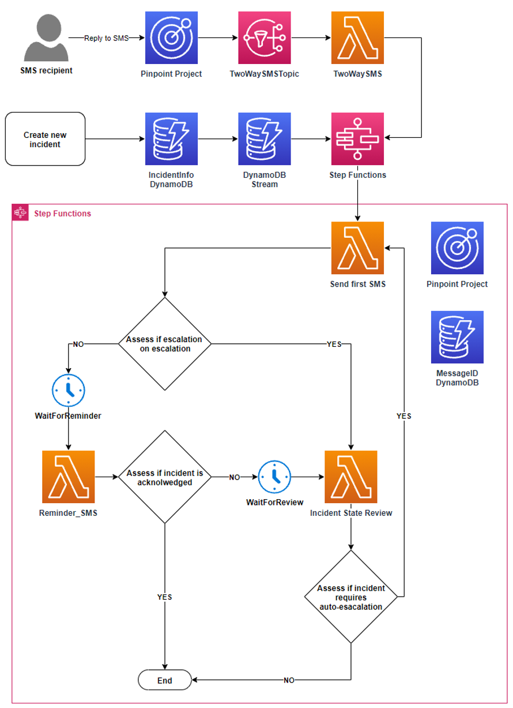
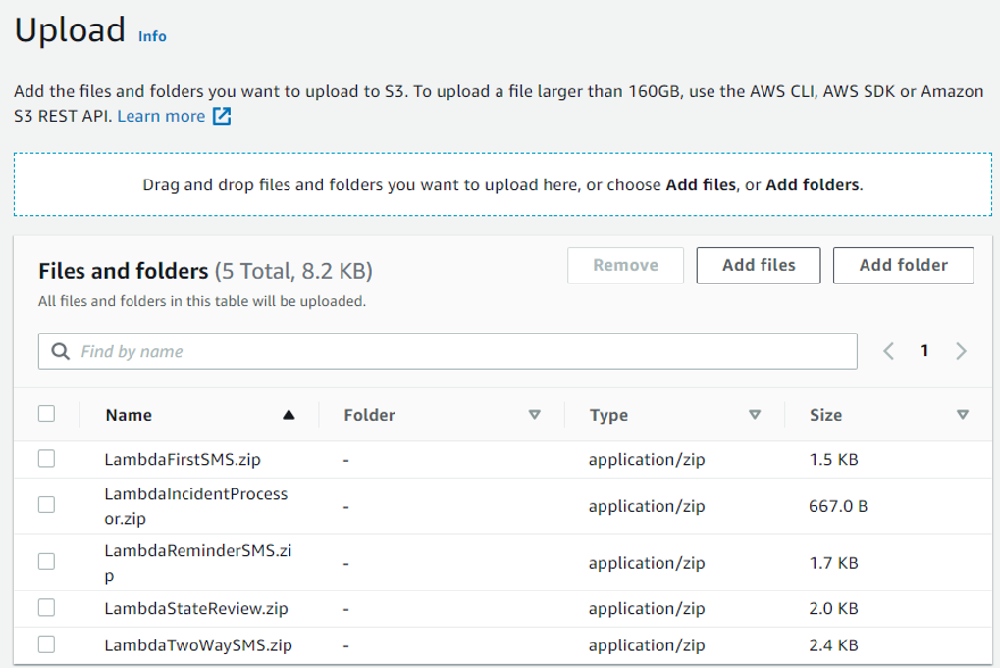
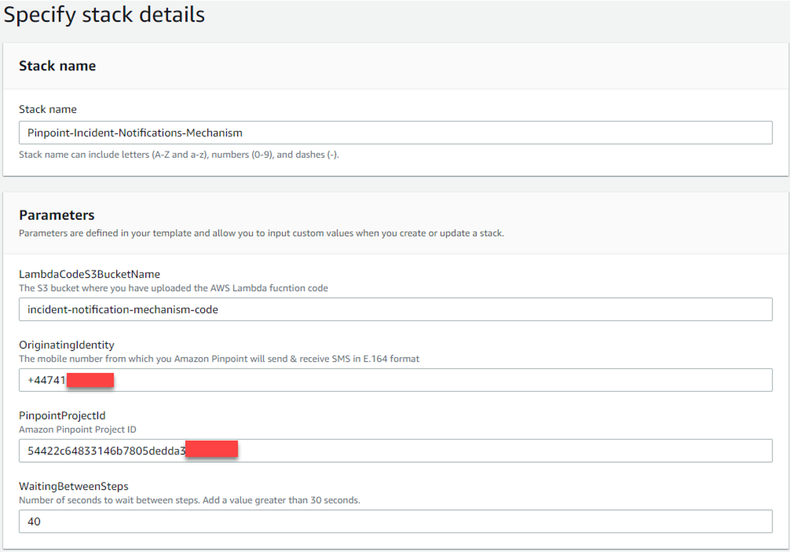
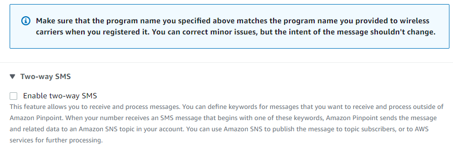
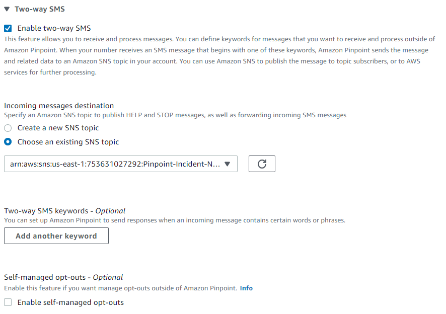

## Amazon Pinpoint Incident Notifications Mechanism

#### Introduction

This repository contains a solution on how you can automate the delivery of incident notifications. It utilises [Amazon Pinpoint SMS channel](https://docs.aws.amazon.com/pinpoint/latest/userguide/channels-sms.html) to contact the designated resources who might not have access to the internet. Furthermore, the recipient of the SMS is able to reply with an acknowledgement. [AWS Step Functions](https://aws.amazon.com/step-functions/) orchestrates the user journey using [AWS Lambda functions](https://aws.amazon.com/lambda/) to evaluate the recipients’ response and trigger the next best action. The solution can be deployed with [AWS CloudFormation](https://aws.amazon.com/cloudformation/).

This repository is part of a blog post **TO DO** where you can find step-by-step instructions.

#### Architecture

The solution requires the country of your SMS recipients to support two-way SMS. To check this visit this [page](https://docs.aws.amazon.com/pinpoint/latest/userguide/channels-sms-countries.html) and look at the column Supports two-way SMS.  If two-way SMS is supported then you will need to obtain a dedicated originating identity. You can also use Toll Free Number or 10DLC if your recipients are in the US.

[^note]:
  Sender id doesn’t support two-way SMS.

The code in this solution uses [AWS SDK for Python (Boto3)](https://aws.amazon.com/sdk-for-python/). 

 
 
#### Prerequisites

1.	An Amazon Pinpoint project with the SMS channel enabled – [Guide on how to enable Amazon Pinpoint SMS channel](https://docs.aws.amazon.com/pinpoint/latest/userguide/channels-sms-setup.html)
2.	Check if the country you want to send SMS to supports two-way SMS – [List with countries that support two-way SMS](https://docs.aws.amazon.com/pinpoint/latest/userguide/channels-sms-countries.html)
3.	An originating identity that supports two-way SMS – [Guide on how to request a phone number](https://docs.aws.amazon.com/pinpoint/latest/userguide/settings-sms-request-number.html)
4.	Increase the your monthly SMS spending quota for Amazon Pinpoint – [Guide on how to increase the monthly SMS spending quota](https://docs.aws.amazon.com/pinpoint/latest/userguide/channels-sms-awssupport-spend-threshold.html)

#### Deployment

**Step 1:** Create an S3 bucket

1.	Navigate to the [Amazon S3 console](https://s3.console.aws.amazon.com/s3/home)
2.	Select **Create bucket**
3.	Enter a unique name for **Bucket name**
4.	Select the **AWS Region** to be the same as the one as you Amazon Pinpoint project
5.	Scroll to the bottom of the page and select **Create bucket**
6.	Clone this repository to your computer and navigate to  **\amazon-pinpoint-incident-notifications-mechanism-main\src**.  
7.	Access the S3 bucket created above and upload the five .zip files

 

**Step 2:** Create a stack

The application is deployed as an [AWS CloudFormation](https://aws.amazon.com/cloudformation) template.
1.	Navigate to the [AWS CloudFormation console](https://console.aws.amazon.com/cloudformation/home) select **Create stack > With new resources (standard)**
2.	Select **Template is ready** for **Prerequisite – Prepare template** and **Upload a template file** as **Template source**
3.	Select **Choose file** and from the repository downloaded in step 1.6 navigate to **amazon-pinpoint-incident-notifications-mechanism-main\cfn** upload **CloudFormation_template.yaml** and select **Next**
4.	Type **Pinpoint-Incident-Notifications-Mechanism** as **Stack name**, paste the S3 bucket name created in step 1 as the **LambdaCodeS3BucketName**, type the Amazon Pinpoint Originating Number in E.164 format as **OriginatingIdenity**, paste the Amazon Pinpoint project ID as **PinpointProjectId** and type **40** for **WaitingBetweenSteps**

 
 
5.	Select **Next**, till you reach to **Step 4 Review** where you will need to check the box **I acknowledge that AWS CloudFormation might create IAM resources** and then select **Create Stack**. 
6.	The process of creating the stack takes 1 – 2 minutes. Click on the refresh button to get the latest event regarding the deployment status. Once the stack has been deployed successfully you should see the last **Event** with **Logical ID Pinpoint-Incident-Notifications-Mechanism** and with **Status CREATE_COMPLETE**

**Step 3:** Configure two-way SMS SNS topic

1.	Navigate to the [Amazon Pinpoint console](https://console.aws.amazon.com/pinpoint/home) > SMS and voice > Phone numbers. Select the phone number that you have obtained for two-way SMS. Scroll to the bottom of the page and click to expand the **Two-way SMS** and check the box to enable it. 



For SNS topic select **Choose an existing SNS topic** then using the drop down choose the one that contains the name of the name of the AWS CloudFormation stack from Step 1 as well as the name **TwoWaySMSSNSTopic** and click **Save**. 



**Step 4:** Create a new incident

To create a new incident, navigate to [Amazon DynamoDB console](https://console.aws.amazon.com/dynamodbv2/home) > Tables and select the table containing the name of the **AWS CloudFormation stack** from Step 1 as well as the name **IncidentInfoDynamoDB**. Select **View items** and then **Create item**. 
On the **Create item** page choose **JSON**, copy and paste the JSON below into the text box and replace the values for the **first_contact** and **second_contact** with a valid mobile number that you have access. 

[^note]:
  If you do not have two different mobile numbers, enter the same across both first_contact and second contact fields. The mobile numbers must follow E.164 format +<country code><number>. 
  
```JSON
{
   "incident_id": {
    "S": "123"
   },
   "incident_stat": {
    "S": "not_acknowledged"
   },
   "double_escalation": {
    "S": "no"
   },
   "description": {
    "S": "Error 111, unit 1 malfunctioned. Urgent assistance is required."
   },
   "url": {
    "S": "https://example.com/incident/111/overview"
   },
   "first_contact": {
    "S": "+4479083---"
   },
   "second_contact": {
    "S": "+4479083---"
  }
 }
```

Incident fields description:
  
•	**incident_id:** Needs to be unique.
•	**incident_stat:** This is used from the application to store the incident status. When creating the incident, this value should always be not_acknowledged.
•	**double_escalation:** This is used from the application flag if the recipient tries to escalate an incident that is already escalated. When creating the incident, this value should always be **not_acknowledged**.
•	**description:** You can type a description that best describes the incident. Be aware that depending the number of characters the SMS parts will increase. For more information on SMS character limits visit this [page](https://docs.aws.amazon.com/pinpoint/latest/userguide/channels-sms-limitations-characters.html). 
•	**url:** You can add a URL that resources can access to resolve the issue. If this field is not pertinent to your use case then type **no url**.
•	**first_contact:** This should contain the mobile number in E.164 format for the first resource.
•	**second_contact:** This should contain the mobile number in E.164 format for the second resource. The second resource will be contacted only if the first one does not acknowledge the SMS or declines the incident.

Once the above is ready you can select **Create item**. This will execute the AWS Step Functions State machine and you should receive an SMS. You can reply with **yes** to acknowledge the incident or with **no** to decline it. Depending your response, the incident status in the DynamoDB table will be updated and if you reply no then the incident will be escalated sending a SMS to the **second_contact**.
  
[^note]:
  The SMS response is not case sensitive.

#### Security

See [CONTRIBUTING](CONTRIBUTING.md#security-issue-notifications) for more information.

#### License

This library is licensed under the MIT-0 License. See the LICENSE file.

